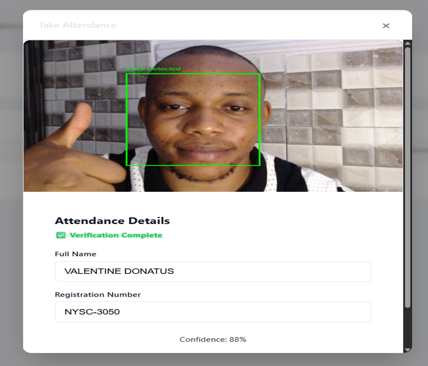

# 🧑‍💻 Facial Recognition Attendance System


## 📖 Project Overview

The **Facial Recognition Attendance System** is an advanced, AI-driven application designed to automate user enrollment and daily attendance tracking using live face recognition. Built with a fast, decoupled architecture, it leverages deep learning models to identify users seamlessly via webcam feeds and logs their attendance in real-time.

### Main Purpose

To provide organizations, schools, or event organizers with a touchless, highly accurate, and scalable solution for managing attendance without the need for manual data entry or legacy hardware devices (like fingerprint scanners).

---

## 🛠 Tech Stack

### Frontend

- **React.js** (Vite): High-performance UI rendering.
- **React Router**: Client-side routing.
- **State Management & Hooks**: Custom hooks (`useCamera`, `useFaceCapture`, `useFaceModel`, `uselive`).
- **CSS3**: Responsive and modern styling.

### Backend

- **FastAPI**: Asynchronous Python web framework for blazing-fast API endpoints.
- **Uvicorn**: ASGI server for running the FastAPI application.
- **Pydantic**: Robust data validation and schema definitions.

### AI / Machine Learning

- **FaceNet512 / ONNX**: Generating 512-dimensional face embeddings via `onnxruntime`.
- **MediaPipe / RetinaFace**: High-precision face detection.
- **FAISS (Facebook AI Similarity Search)**: Blazing-fast vector similarity search for face matching.
- **OpenCV**: Image preprocessing and base64 handling.

### Database

- **Flat-File Database (CSV)**: Lightweight and portable persistent storage for enrollments and attendance logs using `pandas`.

---

## 📂 Project Structure

```text
.
├── app/
│   ├── backend/
│   │   ├── data/                 # Stores CSV databases (enrollments.csv, attendance.csv)
│   │   ├── models/               # Stores ONNX model files (e.g., facenet512.onnx)
│   │   ├── routes/               # FastAPI route controllers (enroll.py, attendance.py, stats.py)
│   │   ├── services/             # Core business logic (face_service, attendance_service)
│   │   ├── config.py             # Backend configuration and constants
│   │   ├── db.py                 # CSV Read/Write operations and data validation
│   │   ├── main.py               # FastAPI entry point & CORS configuration
│   │   ├── modelconfig.py        # ML wrapper configurations
│   │   └── requirements.txt      # Python dependencies
│   └── frontend/
│       ├── public/               # Static web assets
│       ├── src/
│       │   ├── components/       # Reusable UI components (LiveRecognition, Dashboard, etc.)
│       │   ├── hooks/            # Custom logic hooks (useCamera, useFaceLoop, useLive, etc.)
│       │   ├── services/         # API abstraction layer (api.js)
│       │   ├── App.jsx           # Main React layout and routing router
│       │   └── main.jsx          # React DOM entry point
│       ├── package.json          # Node dependencies
│       └── vite.config.js        # Vite bundler configuration
```

---

## ✨ Features

- **Automated Enrollment:** Capture user details and facial data natively from the browser.
- **Live Recognition:** Real-time facial inference matching against the enrolled database.
- **Seamless Attendance Logging:** Automatically marks attendance and prevents duplicate daily entries.
- **Interactive Dashboard:** View real-time statistics including attendance rates, peak hours, and gender distribution.
- **High-Speed Inference:** Uses `faiss-cpu` for sub-millisecond vector querying over thousands of embeddings.

---

## 🔄 System Workflow

1. **Client Interface:** The user opens the React frontend. The custom `useCamera` hook activates the device webcam.
2. **Frame Capture:** The frontend continuously grabs base64 image frames or captures multiple shots during the enrollment phase.
3. **Payload Dispatch:** The images are structured via JSON and sent to the FastAPI backend endpoints via `Axios`/`Fetch`.
4. **AI Inference Pipeline:**
    - Backend preprocesses the base64 images using OpenCV.
    - A face detection layer (MediaPipe/RetinaFace) extracts the face bounding box.
    - The cropped face is passed to `FaceNet512` (running on ONNX Runtime) to generate a `512D` embedding.
5. **Vector Search / DB Ops:**
    - **Enrollment:** The new embedding is saved into `enrollments.csv`.
    - **Attendance:** The embedding is queried against the in-memory FAISS index (`IndexFlatIP`), The attendance log is saved to the `attendance.csv`.
6. **Response:** If a cosine similarity threshold is met, the user identity is returned, and `attendance.csv` is updated.
7. **UI Update:** The frontend flashes a success state and dynamically updates the dashboard numbers.

---

## 🚀 Installation & Setup

### 1. Clone the Repository

```bash
git clone https://github.com/mideyolu/Attendance-System.git
cd Attendance-System
```

### 2. Backend Setup

```bash
cd app/backend

# Create a virtual environment (optional but recommended)
python -m venv venv
source venv/bin/activate  # On Windows use: venv\Scripts\activate

# Install dependencies
pip install -r requirements.txt

# Run the FastAPI server
uvicorn main:app --host 0.0.0.0 --port 8000 --reload
```

### 3. Frontend Setup

```bash
cd app/frontend

# Install node modules
npm install

# Start the Vite development server
npm run dev
```

> **Note:** The frontend will typically run on `http://localhost:5173/`, and the backend on `http://localhost:8000/`.

---

## 📡 API Endpoints

| Method   | Endpoint            | Description                                                                              |
| -------- | ------------------- | ---------------------------------------------------------------------------------------- |
| **POST** | `/enroll`           | Accepts user details & face images. Extracts embedding and registers the user.           |
| **POST** | `/attendance`       | Accepts live camera frames. Extracts embeddings, performs FAISS lookup, logs attendance. |
| **GET**  | `/enroll/stats`     | Returns total registered users, gender metrics, and table row data.                      |
| **GET**  | `/attendance/stats` | Returns daily attendance percentage, present count, errors, and peak hour.               |

---

## 🗄 Database

Currently, the system is file-dependent for fast portability, using two distinct files in data:

1. **`enrollments.csv`**: Stores `regno`, `name`, `gender`, `itype`, `embedding` (JSON string array), and `created_at`.
2. **`attendance.csv`**: Acts as a rolling log storing `name`, `regno`, `status`, `score` (confidence margin), `date`, and `time`.

---

## 🧠 AI/ML Technical Details

- **Model Utilized:** `FaceNet512` executed dynamically via `onnxruntime` for high throughput bypassing heavy TensorFlow/PyTorch dependencies.
- **Vector Search Engine:** `faiss-cpu`.
- **Similarity Metric:** The FAISS index uses `IndexFlatIP` (Inner Product). As FaceNet applies L2 normalization natively, Inner Product is equivalent to **Cosine Similarity**, calculating the angular distance between vectors to ensure confident matching regardless of lighting nuances.

---

## 🔐 Authentication

_Note: The system currently operates without an explicit protective authentication layer (e.g., JWT endpoints or OAuth) for administrative access. Any user parsing the root URL can interact with the app. Adding Role-Based Access Control (RBAC) is suggested for production._

---

## 🌍 Deployment

**Backend (Production)**
Recommended to deploy via Docker wrapping `Gunicorn` handling `Uvicorn` workers.

```bash
gunicorn main:app -w 4 -k uvicorn.workers.UvicornWorker
```

**Frontend (Production)**
Build the static assets using Vite and host seamlessly on platforms like Vercel, Netlify, or Nginx.

```bash
npm run build
```

---

## ⚙️ Environment Variables

Create a `.env` file in the root of your frontend directory if you plan to abstract API paths.

```env
# app/frontend/.env.example
VITE_API_URL=http://localhost:8000
```

> Currently, the backend configures environmental paths intrinsically via `backend/config.py`.

---

## 📸 Screenshots

| Dashboard View               | Live Recognition               |
| ---------------------------- | ------------------------------ |
| _(Add your screenshot here)_ |  |

---

## 🔮 Future Improvements & Recommendations

1.  **Database Migration:** Transition from CSV to PostgreSQL / MongoDB for transactional integrity. Use vector databases like Milvus, Qdrant, or pgvector for FAISS scaling.
2.  **Advanced Anti-Spoofing:** Implement a Deep Learning liveness detection pipeline to prevent users from presenting digital photos to the camera. Explore depth sensing and 3D liveness modules for higher security.
3.  **Admin Authentication:** Implement secure JWT login routes shielding the `/enroll` and `/stats` visualization panels.
4.  **Low-Light Optimization:** Integrate adaptive lighting models beyond standard CLAHE to ensure high recognition accuracy in dimly lit environments.
5.  **Cloud Infrastructure:** Replace local CSV storage with hosted database solutions and real-time synchronization for global data access.
6.  **Multi-Camera Integration:** Support simultaneous streams from multiple camera nodes to cover large areas without bottlenecks.
7.  **Mobile Ecosystem:** Develop native iOS and Android applications to allow for mobile management and attendance tracking.
8.  **Duplicate Enrollment Prevention:** Implement a "One-Face-One-Identity" check during enrollment that scans the existing FAISS index to prevent the same individual from registering under multiple IDs.
9.  **Session-Based Attendance Logic:** Introduce a sessionized recognition workflow where each user is granted a maximum of **2 trials** per session. If recognition fails twice, the system flags the attempt for manual administrator review.
10. **Dockerization:** Add a `docker-compose.yml` to spin up both frontend and backend synchronously in isolated containers.

---

## 📜 License

This project is licensed under the **MIT License**. See the LICENSE file for details.
